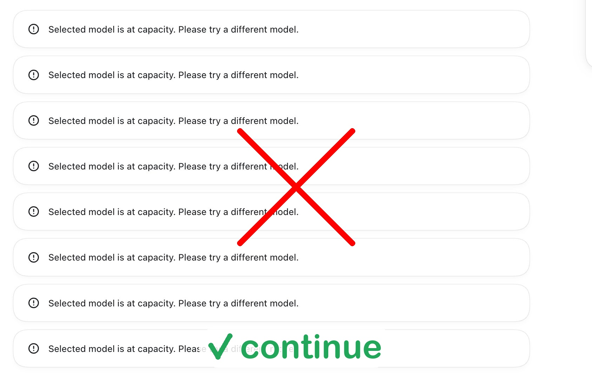

# codex-autocontinue

**简体中文** | [English](README.en.md)

后台看守工具：当 Codex 因提示 `Selected model is at capacity. Please try a different model.` 暂停时，自动回复 `continue`，无需手动输入

<p align="center"></p>

## 快速开始

依赖：Python 3（仅标准库，无第三方包）

macOS / Linux 执行下面的命令，克隆到 `~/.codex-autocontinue` 并完成安装：

```sh
curl -fsSL https://raw.githubusercontent.com/faithk7/codex-autocontinue/main/bootstrap.sh | bash
```

Windows PowerShell 请改用：

```powershell
irm https://raw.githubusercontent.com/faithk7/codex-autocontinue/main/bootstrap.ps1 | iex
```

也可以克隆仓库后手动安装：

```sh
git clone https://github.com/faithk7/codex-autocontinue.git
cd codex-autocontinue
./install.sh                 # macOS / Linux
.\install.ps1                # Windows PowerShell
```

`install` 只需运行一次：注册为系统服务（macOS 用 launchd，Linux 用 `systemd --user`，Windows 用任务计划程序），开机自启，崩溃自动重启，并把 `codex-autocontinue` 和短命令 `cac` 加入 PATH（Windows 用 `cac.ps1`）。服务自带 PATH（含 Homebrew 路径）

macOS 上会弹出系统授权窗口，点“允许”，全程不需要 sudo、brew、pip

验证：

```sh
cac status
cac logs -n 20
```

正式启用前，建议先用 `./codex-autocontinue.py --dry-run`（只记录不注入）或 `./codex-autocontinue.py --simulate-event` 演练一遍。默认为 LIVE 模式（`dry_run: false`）

后续更新：在仓库目录执行 `git pull`，然后重新运行安装脚本（或 `cac start` 重启生效）。再跑一遍上面的安装命令也行

## 功能特性

| 功能 | 说明 |
|---|---|
| 静默运行 | 在后台运行，每次动作只向 `watcher.log` 写一行日志。无通知、无界面。CLI 注入不抢焦点；桌面应用注入必须先激活应用才能打字（见已知限制）。 |
| 精确会话路由 | 根据 rollout 文件定位受影响的会话：tmux 面板和终端按 tty 精确匹配；桌面应用、ydotool、Windows 则注入到当前聚焦或第一个匹配的窗口（见已知限制）。 |
| 队列感知 | 会话已有排队消息时不插手，让排队的消息自己推动继续。 |
| 速率限制 | 通过单会话冷却和全局每小时上限，避免重复输入（两者都在内存里，重启后重置）。 |
| 优雅降级 | 平台无可用注入工具时继续检测，并在日志中提示手动输入。 |
| 演练模式 | 只记录打算注入什么，不实际发送，适合在正式启用前先验证一遍。 |

## 平台支持

| 平台 | 支持程度 | 注入方式 |
|------|----------|----------|
| macOS | 完整支持 | tmux、AppleScript（iTerm2 / Terminal.app）、ChatGPT 应用 |
| Linux | 有辅助工具时完整支持，否则仅检测 | tmux、xdotool（X11）、ydotool（Wayland） |
| Windows | 尽力而为 | PowerShell SendKeys |

辅助工具全部可选：`tmux`、`xdotool`（X11）、`ydotool`（Wayland）、PowerShell（Windows）。就算一个都没有，程序也照常检测事件，只在日志里提示“请手动输入 continue”，不会报错退出

## 使用方法

各平台命令完全一致：安装后用 `cac <命令>`，在检出目录里用 `./codex-autocontinue.sh <命令>` 或 `.\cac.ps1 <命令>`。两个包装脚本只是入口，实际逻辑都在 Python 里（仅标准库），输出带颜色，遵循 `NO_COLOR` 和非 TTY 管道场景：

```
install        一次性：注册到系统服务管理器、启动、自检、打印后续步骤
uninstall      停止并移除服务与 PATH 项，列出残留文件
               （--purge 会一并删除 watcher.log 和 shell 启动文件中的 PATH 行）
start          启动（或重启）看守进程
stop           停止（仍保持安装状态，下次登录时自动启动）
status         查看运行状态：pid、运行时长、模式（DRY-RUN/LIVE）、注入方式可用性、自动续聊次数
logs           高亮显示并持续跟踪看守日志
               （-n N 只打印最后 N 行不跟踪；-f 强制跟踪）
doctor         检查 macOS 授权状态与注入方式健康度
               （--fix 重新执行授权引导）
```

<details>
<summary>守护进程参数（一般无需直接使用）</summary>

```sh
./codex-autocontinue.py --dry-run        # 只记录日志，不实际注入
./codex-autocontinue.py --no-dry-run     # 实际注入（覆盖配置文件）
./codex-autocontinue.py --once           # 只轮询一次然后退出
./codex-autocontinue.py --simulate [ID]  # 打印某个线程的注入计划
./codex-autocontinue.py --simulate-event # 在临时 Codex 目录中模拟容量事件（只演练）
```

</details>

## 配置

编辑仓库中的 `config.json`：

| 配置项 | 默认值 | 说明 |
|--------|--------|------|
| `phrase` | `"model is at capacity"` | 触发短语（不区分大小写） |
| `reply` | `"continue"` | 触发后注入的文本 |
| `poll_interval_seconds` | `0.25` | 轮询日志数据库的间隔 |
| `response_delay_seconds` | `1.0` | 注入前的随机延迟（±25%） |
| `skip_when_queued` | `true` | 会话有排队消息时保持静默 |
| `per_thread_cooldown_seconds` | `60` | 同一会话两次回复之间的最小间隔 |
| `max_continues_per_hour` | `20` | 所有会话合计的每小时上限 |
| `dry_run` | `false` | 只记录“将要做什么”，不实际注入 |
| `desktop_app_name` | `"ChatGPT"` | 目标 Codex 桌面应用名称 |
| `inject_cli` | `true` | 允许向 CLI 会话注入 |
| `inject_app` | `true` | 允许向桌面应用注入 |
| `use_tmux` | `true` | 有 tmux 时使用 tmux send-keys |
| `use_applescript` | `true` | macOS 上使用 AppleScript（iTerm2 / Terminal.app / 应用） |
| `use_xdotool` | `true` | Linux/X11 上优先使用 xdotool |
| `use_ydotool` | `true` | Linux/Wayland 上优先使用 ydotool |

## 工作原理

1. 轮询 `~/.codex/logs_2.sqlite`，只处理新产生的 "model is at capacity" 日志（不会处理启动前的历史记录）
2. 根据会话的 rollout 文件判断它是 Codex CLI 会话（tmux / iTerm2 / Terminal.app）还是 ChatGPT 桌面应用
3. 会话里已有排队消息就不插手，排队的消息自己会让会话继续
4. 通过 `src/injectors.py` 把 `continue` 输入到对应的会话（tmux/终端按 tty 精确匹配；桌面应用注入到当前聚焦窗口；详见已知限制）
5. 每次动作只向 `watcher.log` 写一行日志

## 测试

检测与路由由标准库单元测试覆盖：在临时目录里构造一套假的 Codex 状态（sqlite + rollout），不会动你真实的 `~/.codex`：

```sh
python3 -m unittest discover -s tests
```

`--simulate-event` 会对一条合成的 "Selected model is at capacity" 日志做同样的演练

<h2 id="known-limitations">已知限制</h2>

<details>
<summary>展开查看</summary>

- **会话路由只有“CLI / 其他”两种。** 任何非 CLI 会话（VSCode 插件、`exec`、subagent）都会被当作桌面应用会话，向 `desktop_app_name` 发送按键。如果你只想覆盖 CLI，请设置 `"inject_app": false`
- **Linux/Wayland（ydotool）向当前聚焦的窗口输入**，不是指定的 Codex 窗口。要么让 Codex 终端保持聚焦，要么用 tmux
- **Windows 上会向任意一个能激活的 `codex.exe` 窗口发送**，多会话时可能进错窗口。自定义 `reply` 里的 `'` 和 SendKeys 元字符（`+ ^ % ~ [ ] { }`）不会被转义，只用纯单词比较保险
- **Linux/X11（xdotool）通常匹配不到窗口**：它按 `codex` 子进程 pid 找窗口，但窗口属于终端模拟器。X11 上想可靠就用 tmux，否则只能停在仅检测模式
- **`--simulate THREAD_ID` 会显示该线程的最新日志行，即使它不是容量事件**，记得核对它报告的行 id。不带参数的 `--simulate` 会按短语过滤
- **`--once` 只能看到它那一轮轮询里写入的行**（启动时就打好了水位），只适合检查链路通不通，不能用来补处理漏掉的事件
- **交互式运行只打印到控制台，不写入 `watcher.log`**；只有服务托管运行时才会追加日志。反过来，以服务运行时 `DRY-RUN` 行可能在日志里出现两次（一次直接写文件，一次经由捕获的 stdout）
- **`uninstall` 只移除服务和 PATH 项，shell 启动文件里的 `~/.local/bin` 行和 `watcher.log` 会保留**，加 `--purge` 才一并清掉。仓库目录本身始终保留，不需要就手动删掉
- **桌面应用注入会先激活应用，再向当前聚焦窗口打字**，会短暂抢焦点；日志里的“已注入”只表示按键已发出——如果中途有别的窗口抢走焦点，回复可能进错地方。CLI 注入（tmux / iTerm2 / Terminal）精确且不抢焦点
- **只有注入失败会重试，其余跳过都是一次性的。** 注入器报错或没找到目标时最多重试 3 次（退避 5 秒 / 15 秒 / 30 秒）；冷却、上限、有排队消息、注入被禁用等跳过会直接消费该事件，不重试
- **冷却和每小时上限只存在内存里**，看守重启后重置；重启后的第一个新事件会立即注入（重启前的历史记录仍然不会补处理）
- **演练模式会如实报告正式模式下会被跳过的事件**：它跑同样的路由、限流和队列检查并记录 `would skip：原因`，只是不真正按键
- **iTerm2 说明：** 注入依赖 `write text` 自动回车（已在 iTerm2 3.7.2 上验证只提交一次）。如果未来版本不再自动回车，那里的 CLI 回复会停在输入框不执行，欢迎反馈

</details>

## 问题反馈

有 bug、边界情况或功能建议，欢迎提交 Issue
